# Flappy Bird Reinforcement Learning Agent

**Final Project — Reinforcement Learning**
*Reichman University (RUNI), 2025*

Training an RL agent to play Flappy Bird using **Q-Learning** and **SARSA**, comparing off-policy vs on-policy tabular methods on the same environment with identical state representations and reward shaping.

**Authors:** [Efi Pecani](https://github.com/Efi-Pecani) & Adi Zur

---

## The Agent in Action

### Untrained vs Trained

<table>
  <tr>
    <td align="center"><b>Random Agent (untrained)</b></td>
    <td align="center"><b>Q-Learning (trained)</b></td>
    <td align="center"><b>SARSA (trained)</b></td>
  </tr>
  <tr>
    <td align="center">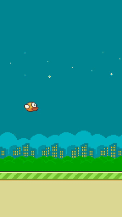</td>
    <td align="center">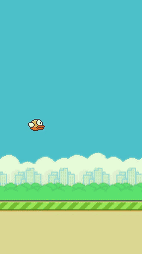</td>
    <td align="center">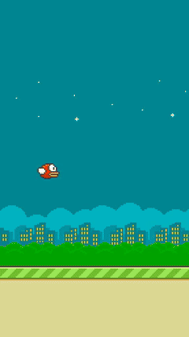</td>
  </tr>
  <tr>
    <td align="center">Dies immediately</td>
    <td align="center">100% success, 139.8 avg score</td>
    <td align="center">100% success, 93.6 avg score</td>
  </tr>
</table>

### Harder Difficulty (pipe gap = 65)

<table>
  <tr>
    <td align="center"><b>Q-Learning (gap=65)</b></td>
    <td align="center"><b>SARSA (gap=65)</b></td>
  </tr>
  <tr>
    <td align="center">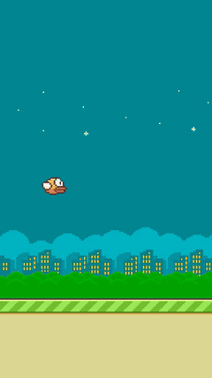</td>
    <td align="center">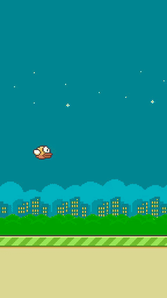</td>
  </tr>
  <tr>
    <td align="center">70% success, 36.1 avg score</td>
    <td align="center">100% success, 65.5 avg score</td>
  </tr>
</table>

### Training Progress

<table>
  <tr>
    <td align="center"><b>Q-Learning Training</b></td>
    <td align="center"><b>SARSA Training</b></td>
  </tr>
  <tr>
    <td align="center">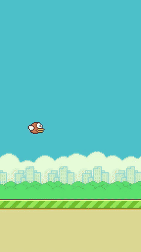</td>
    <td align="center">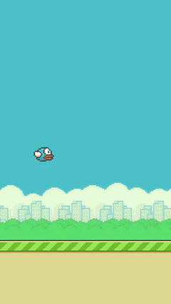</td>
  </tr>
</table>

---

## The Challenge

The [Flappy Bird](https://github.com/ntasfi/PyGame-Learning-Environment) environment has a deceptively large state space. The raw observation contains 8 features with up to 512 values each, producing an astronomically large Q-table (512 x 20 x 288 x 512 x 512 x 288 x 512 x 512 states).

<p align="center">
  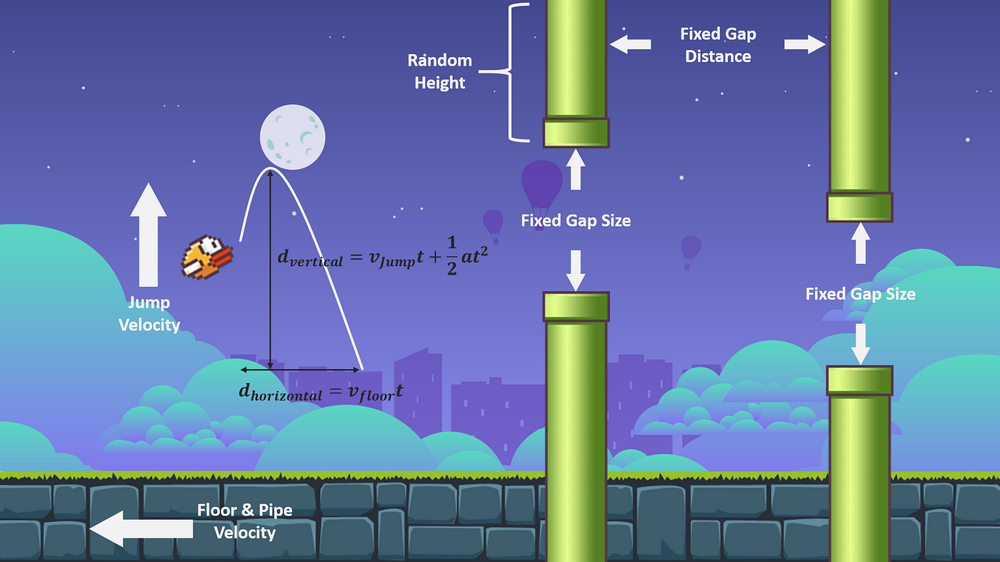
</p>

We reduced this to a manageable **3-feature** representation through careful preprocessing:

| Feature | Description | Values |
|---------|-------------|--------|
| Vertical distance to pipe center | `(player_y - pipe_center) / 4` | 129 |
| Player velocity | Raw velocity value | ~20 |
| Horizontal distance to pipe | `dist / 8`, clipped to 36 | 37 |

This gives a Q-table of ~95,000 states instead of billions — small enough for tabular RL.

---

## Algorithms

### Q-Learning (Off-Policy)

Updates Q-values using the **maximum** future reward regardless of the action actually taken:

```
Q(s,a) <- Q(s,a) + alpha * [r + gamma * max_a' Q(s',a') - Q(s,a)]
```

- **Epsilon decay:** Exponential — `eps = eps_min + (eps_max - eps_min) * e^(-decay * episode)`
- **Behavior:** Aggressive learner, higher peak scores, but less stable

### SARSA (On-Policy)

Updates Q-values using the **actual** next action chosen by the policy:

```
Q(s,a) <- Q(s,a) + alpha * [r + gamma * Q(s',a') - Q(s,a)]
```

- **Epsilon decay:** Multiplicative — `eps = max(eps_min, eps * decay)`
- **Behavior:** More cautious, more stable, better generalization

---

## Reward Shaping

Finding the right reward function was critical. Our initial simple rewards (survive=+1, pipe=+20, die=-20) led to unstable training. The final normalized reward function:

| Signal | Reward |
|--------|--------|
| Survival per step | +0.05 |
| Aligned with pipe center | +0.1 |
| Misaligned with pipe center | -0.2 * sqrt(\|player_y - pipe_center\|) / 512 |
| Successfully passed a pipe | +1.0 |
| Collision (death) | -1.0 |

Normalizing rewards to [-1, 1] and adding alignment incentives was the key breakthrough for stable training.

---

## Results

### Hyperparameter Search (3 experiments per algorithm, 10K episodes each)

**Q-Learning:**

| | Exp 1 | Exp 2 | Exp 3 (best) |
|---|---|---|---|
| Gamma | 0.5 | 0.7 | **0.9** |
| Learning rate | 0.1 | 0.3 | **0.7** |
| Epsilon decay | 0.0001 | 0.0005 | **0.001** |

**SARSA:**

| | Exp 1 | Exp 2 | Exp 3 (best) |
|---|---|---|---|
| Gamma | 0.5 | 0.8 | **0.95** |
| Learning rate | 0.5 | 0.4 | **0.3** |
| Epsilon decay | 0.995 | 0.999 | **0.9995** |

Both algorithms benefited from high gamma (long-term focus). Q-Learning preferred a higher learning rate with faster epsilon decay, while SARSA worked best with a lower learning rate and very gradual exploration decay.

### Training Curves

<table>
  <tr>
    <td align="center"><b>Q-Learning Exp 1</b></td>
    <td align="center"><b>Q-Learning Exp 2</b></td>
    <td align="center"><b>Q-Learning Exp 3</b></td>
  </tr>
  <tr>
    <td align="center">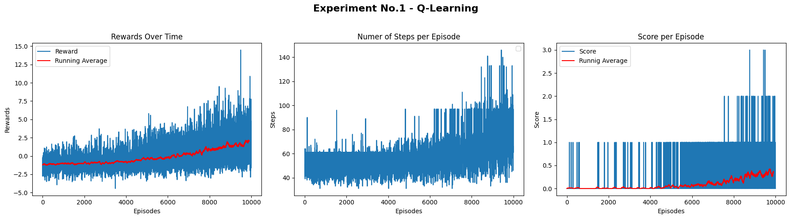</td>
    <td align="center">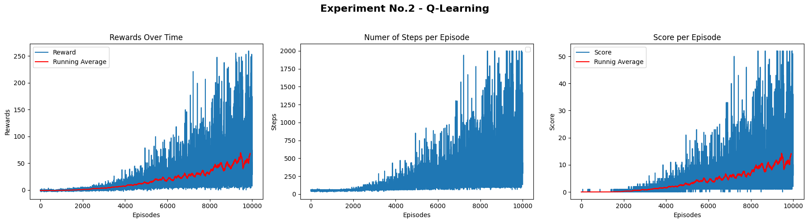</td>
    <td align="center">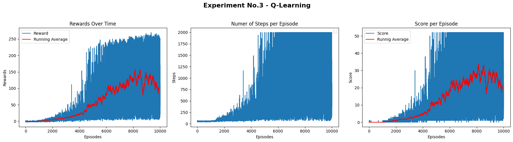</td>
  </tr>
</table>

<table>
  <tr>
    <td align="center"><b>SARSA Exp 1</b></td>
    <td align="center"><b>SARSA Exp 2</b></td>
    <td align="center"><b>SARSA Exp 3</b></td>
  </tr>
  <tr>
    <td align="center">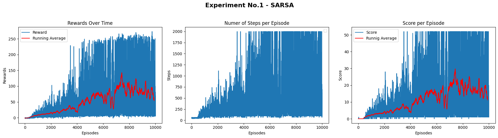</td>
    <td align="center">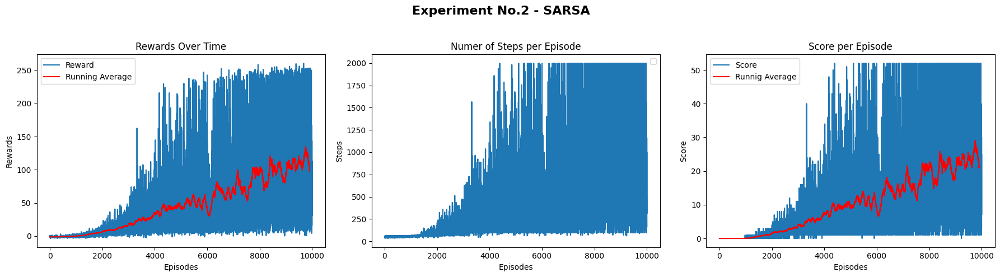</td>
    <td align="center">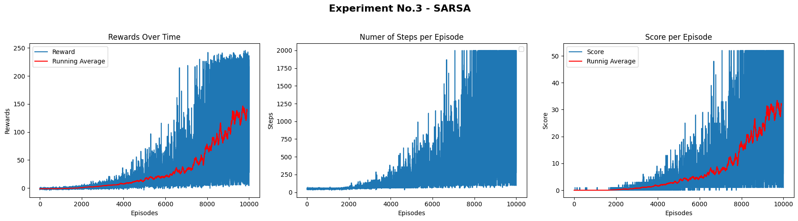</td>
  </tr>
</table>

### Extended Training (30K episodes, best hyperparameters)

<table>
  <tr>
    <td align="center"><b>Q-Learning (gap=80)</b></td>
    <td align="center"><b>Q-Learning (gap=65)</b></td>
  </tr>
  <tr>
    <td align="center">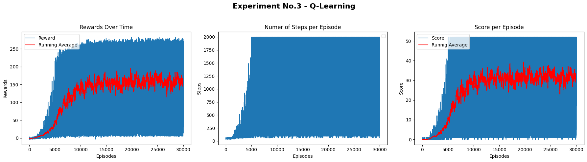</td>
    <td align="center">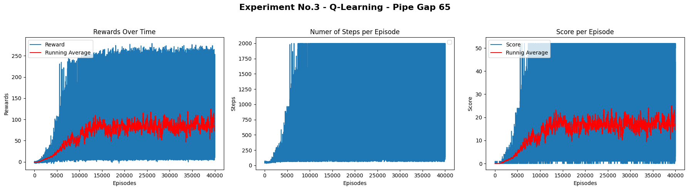</td>
  </tr>
</table>

<table>
  <tr>
    <td align="center"><b>SARSA (gap=80)</b></td>
    <td align="center"><b>SARSA (gap=65)</b></td>
  </tr>
  <tr>
    <td align="center">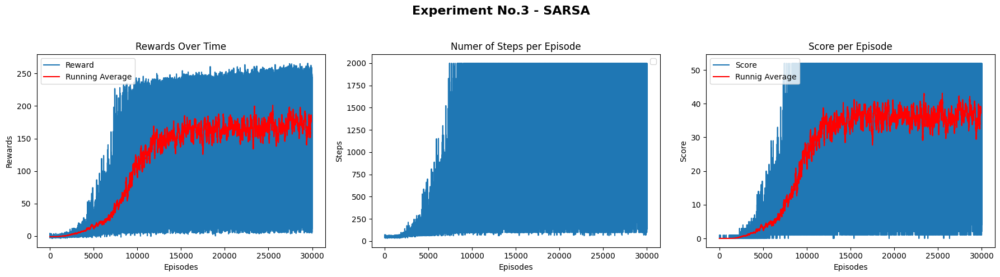</td>
    <td align="center">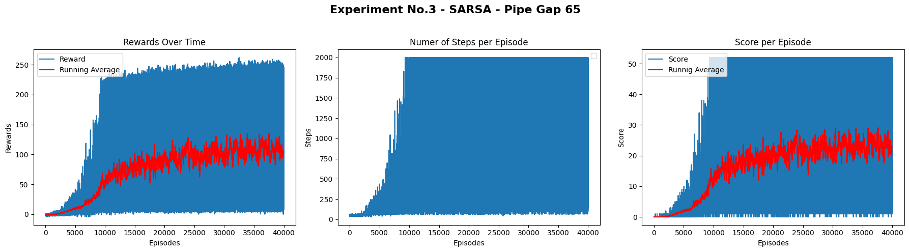</td>
  </tr>
</table>

### Evaluation Summary (10 episodes per configuration)

**Q-Learning:**

| Trained on | Tested on | Success Rate | Mean Score | Best Score |
|-----------|-----------|:---:|---:|---:|
| gap=80 | gap=80 | **100%** | 139.8 +/- 98.0 | 351 |
| gap=80 | gap=65 | 0% | 1.8 +/- 0.9 | 3 |
| gap=65 | gap=80 | 90% | 90.0 +/- 93.2 | 293 |
| gap=65 | gap=65 | 70% | 36.1 +/- 54.6 | 197 |

**SARSA:**

| Trained on | Tested on | Success Rate | Mean Score | Best Score |
|-----------|-----------|:---:|---:|---:|
| gap=80 | gap=80 | **100%** | 93.6 +/- 80.9 | 286 |
| gap=80 | gap=65 | 70% | 15.5 +/- 11.9 | 47 |
| gap=65 | gap=80 | **100%** | 84.9 +/- 67.0 | 257 |
| gap=65 | gap=65 | **100%** | 65.5 +/- 31.8 | 119 |

### Evaluation Graphs

<table>
  <tr>
    <td align="center"><b>Q-Learn gap=80 (trained 80)</b></td>
    <td align="center"><b>Q-Learn gap=65 (trained 80)</b></td>
  </tr>
  <tr>
    <td>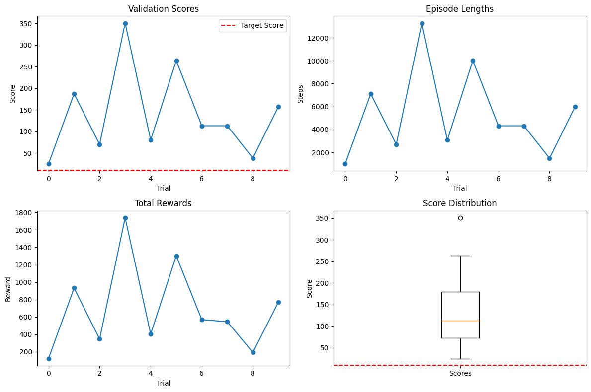</td>
    <td>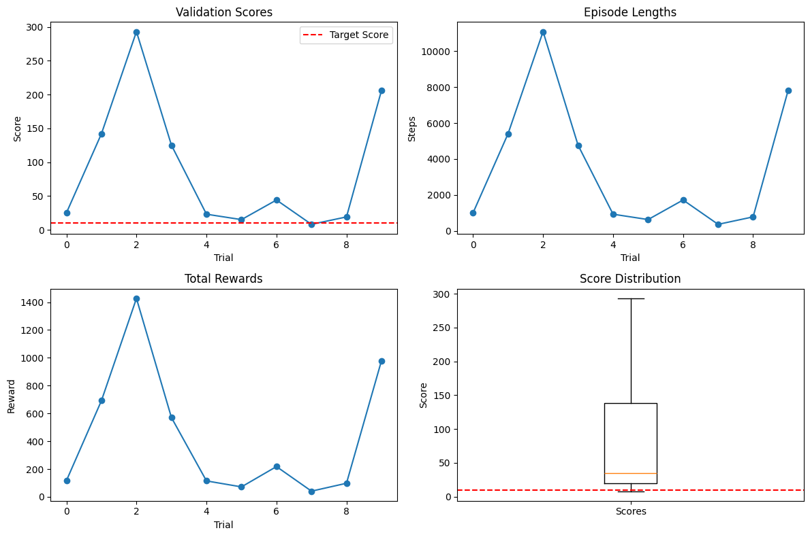</td>
  </tr>
</table>

<table>
  <tr>
    <td align="center"><b>SARSA gap=80 (trained 80)</b></td>
    <td align="center"><b>SARSA gap=65 (trained 80)</b></td>
  </tr>
  <tr>
    <td>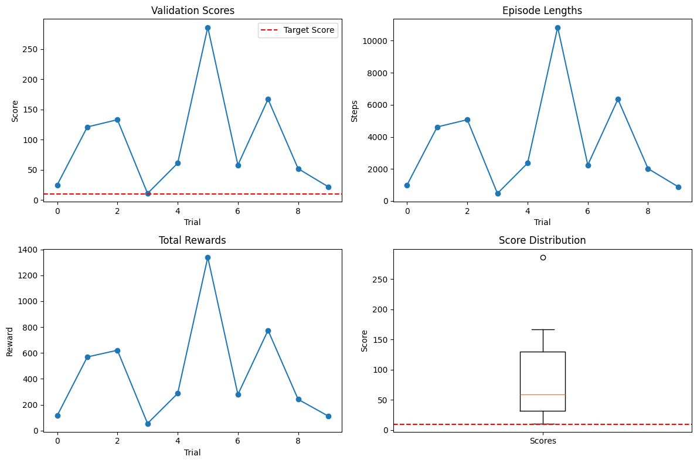</td>
    <td>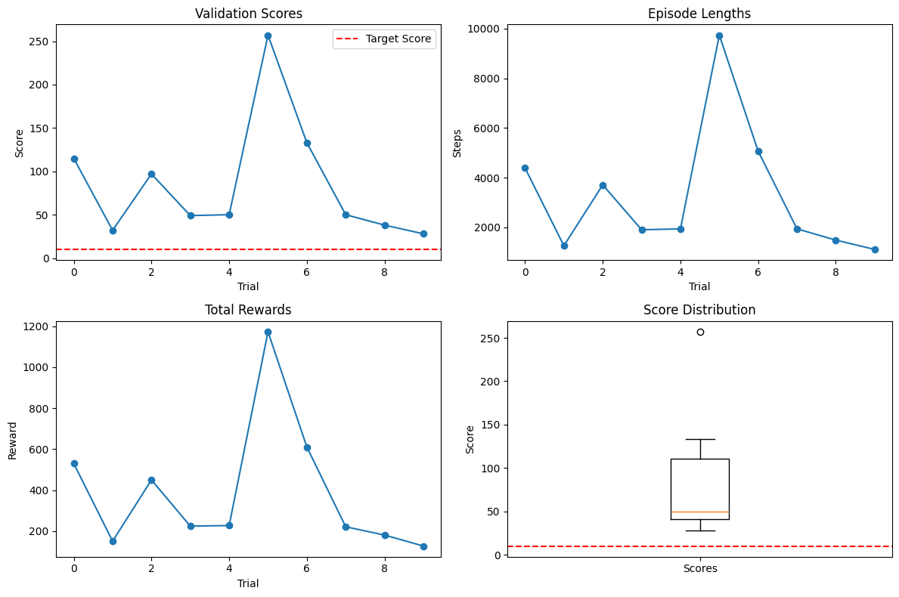</td>
  </tr>
</table>

---

## Key Takeaways

- **Q-Learning** achieves higher peak scores in familiar environments but **fails catastrophically** when tested on harder difficulty it wasn't trained on (0% success on gap=65 when trained on gap=80).
- **SARSA** is more robust and adaptive — maintains high success rates even in unfamiliar conditions, thanks to its on-policy nature that prioritizes safer actions.
- **Reward shaping** was the single most impactful design decision. Normalizing to [-1, 1] and adding pipe-center alignment rewards transformed unstable training into consistent convergence.
- **State space reduction** from billions to ~95K states through careful feature engineering made tabular RL feasible for this visually complex game.

---

## Repository Structure

```
FlappyBird-RL-Agent/
├── Flappy_Bird_RL_Agent_QLearning_SARSA.ipynb  # Main notebook (training + evaluation)
├── assets/                                      # Gameplay GIFs
│   ├── random_agent.gif                         # Untrained agent
│   ├── qlearning_training.gif                   # Q-Learning learning to play
│   ├── sarsa_training.gif                       # SARSA learning to play
│   ├── qlearning_eval_gap80_trained80.gif       # Q-Learning best performance
│   ├── qlearning_eval_gap65_trained65.gif       # Q-Learning harder difficulty
│   ├── sarsa_eval_gap80_trained80.gif           # SARSA best performance
│   └── sarsa_eval_gap65_trained65.gif           # SARSA harder difficulty
├── figures/                                     # Training curves and evaluation plots
│   ├── qlearning_training_agent{1,2,3}.png      # Q-Learning 3 experiments
│   ├── sarsa_training_agent{1,2,3}.png          # SARSA 3 experiments
│   ├── *_extended_gap{65,80}.png                # Extended training curves
│   └── *_eval_gap{65,80}_{rewards,scores}.png   # Evaluation metrics
├── Flappy_Bird_Logo.png
└── flappybird_phisics.png
```

## How to Run

Open `Flappy_Bird_RL_Agent_QLearning_SARSA.ipynb` in [Google Colab](https://colab.research.google.com/). The first cell installs all dependencies (PyGame Learning Environment, gym_ple, pyvirtualdisplay). Then run all cells sequentially.

## Tech Stack

- **Environment:** [PyGame Learning Environment](https://github.com/ntasfi/PyGame-Learning-Environment) (FlappyBird)
- **Algorithms:** Tabular Q-Learning and SARSA (no neural networks)
- **Framework:** NumPy, OpenAI Gym wrapper
- **Visualization:** Matplotlib, imageio (video recording)
- **Training:** Google Colab

## License

Academic project — Reichman University, 2025.
